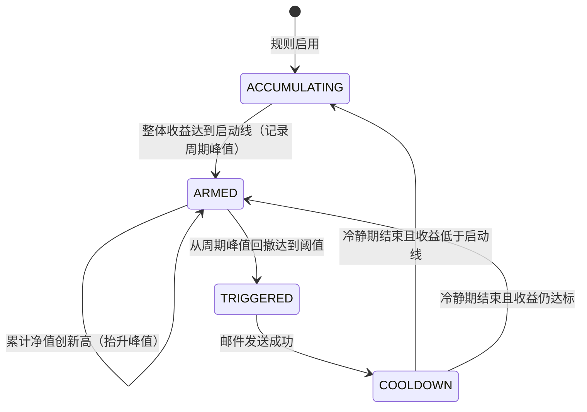

# 提醒与建议型提醒

## 业务目标与边界

提醒规则命中后由后台在固定时间评估并发邮件，系统**不会自动下单**：提醒只是通知，任何买卖仍由用户在基金平台完成。

规则分三类（`AlertRuleKind`）：

| 种类 | 中文名 | 判定 |
| --- | --- | --- |
| `CONDITION` | 条件提醒 | 一组指标条件全部满足即提醒（无状态） |
| `LOGIC_BROKEN` | 逻辑破坏止损 | 条件全部满足时建议全仓卖出 |
| `TRAILING_STOP` | 回撤止盈 | 收益率达标后按周期峰值回撤，建议卖出浮盈的一部分 |

后两类是**建议型规则**：判定自带状态机，结果是「建议卖出多少份额」，只写进邮件正文，不生成交易。

`discipline`（卖出纪律）模块已在 v0.14.0 整体删除。它有价值的两处判定（逻辑破坏止损、回撤止盈）迁移为上表后两类建议型提醒；原先「点一条建议自动生成一笔在途交易」的采纳链路已降级为纯通知，卖出由用户在确认页手工录入。

## 条件引擎

一条条件规则 = 一组条件的**合取（`match=ALL`）**。每条条件的三个要素是：

```
指标（indicator） → 关系（relation） → 参数与阈值（params / value）
```

- **指标码**与元数据以 [IndicatorCode](../../backend/src/main/java/com/fundpilot/backend/alerting/domain/condition/IndicatorCode.java) 为**唯一**来源，前端不硬编码第二份。
- **关系**：`ABOVE` / `BELOW`（与阈值比较）、`CROSS_ABOVE` / `CROSS_BELOW`（当日跨界事件，如金叉/死叉、上穿/下穿）、`INCREASING` / `DECREASING`（较上一期放大/缩小）。
- **参数**：可调窗口与周期，如均线窗口 5–250、MACD 快/慢/信号线、量能均量窗口 3–120；缺省取指标默认值。

### 首批指标（五组维度，共 12 个）

| 维度 | 指标码 | 说明 |
| --- | --- | --- |
| 当日涨跌与持仓收益 | `DAILY_CHANGE`、`HOLDING_RETURN` | 当日涨跌幅、持仓浮动收益率（对应原三阈值规则的 `RISE`/`DROP`/`PROFIT` 语义） |
| 净值与均线 | `PRICE_VS_MA`、`MA`、`MA_CROSS` | 净值与均线偏离率、净值均线数值、均线快慢线差值（`MA_CROSS` 由负转正即金叉） |
| 净值区间与回撤 | `NAV_RANGE_POSITION`、`NAV_DRAWDOWN` | 净值在近 N 日区间中的位置、净值距近 N 日峰值的回撤比例 |
| 量能状态 | `VOLUME_RATIO`、`VOLUME_DROP` | 基准指数量比；`VOLUME_DROP` 额外要求指数收阴（口径与旧纪律的量能状态 `HIGH_DROP` 一致） |
| 周线 MACD 与 PE 估值 | `WEEKLY_MACD_HISTOGRAM`、`INDEX_PE`、`INDEX_PE_PERCENTILE` | 周线 MACD 柱高（红/绿柱、放大/缩小、金叉/死叉）、指数市盈率、指数 PE 历史分位 |

### 指标取值按需计算

指标**不落快照列**，而是由 MarketData 按需现算（`MarketIndicatorComputeApi`、`IndicatorComputeQueryHandler`）。数据源沿用已落库的 `fund_nav_history`（净值历史）、`index_kline`（指数 K 线）、`index_valuation`（指数估值），**不新增外部拉取**。单基金单指标成本 O(窗口)，同日重复求值命中进程内缓存。

### 接口

| 接口 | 用途 |
| --- | --- |
| `GET /api/alert-rules/indicators` | 指标元数据（指标、可选关系、参数定义与范围），驱动前端条件构建器 |
| `POST /api/alert-rules/preview` | 保存前试算草稿规则：用当前数据判断是否命中、命中哪条条件、是否缺数据 |

## 建议型提醒

### 逻辑破坏止损（`LOGIC_BROKEN`）

判定口径照搬旧 `AdvicePolicy`：

| 基金类型 | 必须同时满足 |
| --- | --- |
| ETF、指数、指数增强 | 累计净值跌破年线；周线 MACD 绿柱扩大；基准指数放量下跌 |
| 主动/混合 | 累计净值跌破年线；周线 MACD 绿柱扩大 |

- 主动型基金没有基准指数，豁免量能条件。
- 命中即建议**全部卖出**确认持仓份额；加仓不足 5 个交易日时仍建议卖出，邮件给出提示。
- **连续命中期间只提醒一次**：标记为已触发后不再重复，直到条件不再满足才回到起点。

### 回撤止盈（`TRAILING_STOP`）

用两套净值口径：单位净值计算持仓成本、浮盈与建议份额；累计净值记录周期峰值与回撤。



- 通知链路降级为纯通知后不再等待「卖出确认」，**邮件发送成功即进入冷静期**。
- 条件恢复命中或持仓清空时状态回到起点，允许下次重新提醒。

#### 六个参数与四档预设

| 类型 | 启动收益 | 高点回撤 | 浮盈收割 | 最低保留 |
| --- | --- | --- | --- | --- |
| 宽基 | 15% | 6% | 50% | 50% |
| 行业 | 20% | 8% | 50% | 40% |
| 主动 | 15% | 7% | 50% | 50% |
| 混合 | 12% | 5% | 40% | 60% |

统一单次卖出上限 20%、冷静期 10 个交易日。预设只作为前端一键填值，用户保存自定义值后不被模板静默覆盖。

#### 建议卖出份额

取以下四项的最小值（照搬旧口径）：

1. `浮盈 × 收割比例 ÷ 当前单位净值`
2. `当前份额 × 单次上限`
3. `当前份额 × (1 − 最低保留)`
4. 已持有至少 5 个交易日的成熟可赎回份额

## 通知与幂等

- 每个交易日 14:30（北京时间）由 `AlertEvaluationJob` 评估全部启用规则，逐规则独立事务落库，单条失败不影响其他规则。
- 邮件正文（`AlertEmailGatewayImpl`）含基金名、代码、命中条件、当前净值(估值)、当日涨跌幅、持仓盈亏、持仓收益率与详情链接；建议型规则多一列「建议操作」，写明建议卖出份额，并附提示「以上卖出建议仅为纪律提示，请在确认页手工录入卖出，系统不会自动下单」。
- 幂等键 `uq_alert_notification_rule_day_sent`：同一规则每个交易日最多一条成功通知。
- 建议型规则的运行期状态按「规则 × 组合基金」一行落 `alert_suggestion_state`（阶段、周期起始、周期峰值、冷静期起始），保证同一信号不逐日重复发送。

## 收益分类来源

收益构成按基金类别拆分，类别取产品目录 `fund_product.default_discipline_category`（**保留**该列）。`PortfolioReturnQueryHandler` 前置已拿到该值，v0.14.0 直接改读它，不再依赖已删除的 `DisciplineClassificationApi`；未新建 Portfolio 表、未做数据搬迁。目录值为空的基金做兜底显示。

## 迁移前的旧机制（历史背景）

v0.14.0 之前，卖出纪律由独立 `discipline` 模块承担：`DisciplineStrategy` 保存六参数与止盈周期状态，`AdvicePolicy` 做纯函数判定，`SignalLog`/`discipline_advice` 落每日信号与建议，用户采纳后生成 `PENDING` 交易。生产实测该链路从未产出过有效卖出建议、也从未被采纳，故在本版本整体替换：判定迁移到提醒规则，采纳链路删除，`signal_log`、`discipline_advice`、`discipline_strategy`、`discipline_classification` 四表连同 `fund_transaction` 上的纪律外键列一并 drop。

## 实现与验证入口

- 规则与条件：[AlertRuleController](../../backend/src/main/java/com/fundpilot/backend/alerting/adapter/web/rulemanagement/AlertRuleController.java)、[AlertRuleCommandHandler](../../backend/src/main/java/com/fundpilot/backend/alerting/application/command/rulemanagement/AlertRuleCommandHandler.java)、[IndicatorCode](../../backend/src/main/java/com/fundpilot/backend/alerting/domain/condition/IndicatorCode.java)、[ConditionEvaluator](../../backend/src/main/java/com/fundpilot/backend/alerting/domain/condition/ConditionEvaluator.java)、[ConditionEvaluationService](../../backend/src/main/java/com/fundpilot/backend/alerting/application/condition/ConditionEvaluationService.java)
- 建议型规则：[AlertSuggestionService](../../backend/src/main/java/com/fundpilot/backend/alerting/application/suggestion/AlertSuggestionService.java)、[TakeProfitPolicy](../../backend/src/main/java/com/fundpilot/backend/alerting/domain/suggestion/TakeProfitPolicy.java)、[TakeProfitParams](../../backend/src/main/java/com/fundpilot/backend/alerting/domain/suggestion/TakeProfitParams.java)、[SuggestionState](../../backend/src/main/java/com/fundpilot/backend/alerting/domain/suggestion/SuggestionState.java)
- 调度与通知：[AlertEvaluationJob](../../backend/src/main/java/com/fundpilot/backend/alerting/adapter/scheduler/ruleevaluation/AlertEvaluationJob.java)、[AlertNotificationDispatchCommandHandler](../../backend/src/main/java/com/fundpilot/backend/alerting/application/command/notificationdelivery/AlertNotificationDispatchCommandHandler.java)、[AlertEmailGatewayImpl](../../backend/src/main/java/com/fundpilot/backend/alerting/infrastructure/remote/notificationdelivery/AlertEmailGatewayImpl.java)
- 指标按需计算：[MarketIndicatorComputeApi](../../backend/src/main/java/com/fundpilot/backend/marketdata/adapter/api/indicatorcompute/MarketIndicatorComputeApi.java)、[IndicatorComputeQueryHandler](../../backend/src/main/java/com/fundpilot/backend/marketdata/application/query/indicatorcompute/IndicatorComputeQueryHandler.java)
- 测试：[ConditionEvaluatorTest](../../backend/src/test/java/com/fundpilot/backend/alerting/domain/condition/ConditionEvaluatorTest.java)、[TakeProfitPolicyTest](../../backend/src/test/java/com/fundpilot/backend/alerting/domain/suggestion/TakeProfitPolicyTest.java)、[TakeProfitParamsTest](../../backend/src/test/java/com/fundpilot/backend/alerting/domain/suggestion/TakeProfitParamsTest.java)、[SuggestionStateTest](../../backend/src/test/java/com/fundpilot/backend/alerting/domain/suggestion/SuggestionStateTest.java)、[AlertEvaluationIntegrationTest](../../backend/src/test/java/com/fundpilot/backend/alerting/AlertEvaluationIntegrationTest.java)
- 迁移验证：`docs/operations/discipline-migration-verification/`（离线等价性回放与差异报告）
- 相关决策：[ADR-0015](../adr/0015-pyramid-retire-trailing-stop-decouple.md)、[ADR-0016](../adr/0016-dca-config-auto-invest-not-signal.md)、[ADR-0018](../adr/0018-dca-take-profit-presets-and-cycle.md)、[ADR-0019](../adr/0019-unit-nav-for-accounting.md)
