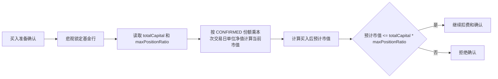

# 资金池与仓位限制

## 业务目标与边界

总资金池是单用户组合的风险预算分母，不是可用现金余额，也不按基金拆分。单基金仓位上限用于阻止新的买入确认继续扩大集中度。

## 外部入金

用户在配置页录入正数金额后：

- 金额累加到唯一用户配置的 `totalCapital`。
- 不创建交易。
- 不直接归属任何基金。
- 后续买入不会从总资金池扣减。
- 当前不支持出金或从历史交易反推总资金池。

因此 `totalCapital` 表达“愿意用于组合风险预算的总资金”，不是银行账户或基金平台余额。

## 单基金仓位上限

- 每只基金保存独立的 `maxPositionRatio`。
- 默认值为 30%。
- 合法范围是 `(0, 0.30]`。
- 数据库 CHECK 和业务层同时保证硬上限。

用户可以将某只基金上限调低，但不能超过系统 30% 硬上限。

## 买入确认校验

所有增加真实投入金额的确认路径都必须执行相同校验：

- `INCREASE`
- `TRANSFER_IN`
- `INVEST`
- 初始持仓同步确认

`ADJUST_IN` 是账实份额修正，不表达新的投入金额，不进入本校验。



公式：

```text
当前事实市值 = CONFIRMED 净份额 * 本次交易日单位净值
预计市值 = 当前事实市值 + 本次投入金额
仓位上限金额 = totalCapital * maxPositionRatio
```

校验使用单位净值。累计净值只适用于复权分析，不能用于仓位约束。

## 时机与并发

- 校验发生在最终确认事务中，不只发生在创建 PENDING 交易时。
- 基金行必须先悲观锁定，防止两笔并发买入同时基于旧持仓通过。
- 初始持仓同步确认也必须走相同校验，不能绕过风险预算。
- 恰好等于上限允许确认，超过才拒绝。

创建 PENDING 买入时允许总资金池暂未配置，因为它尚未改变事实持仓；最终确认前必须完成配置。

## 存量数据

系统不从历史交易推断 `totalCapital`。升级前已有持仓可以继续展示和卖出，但首次外部入金前，新的买入确认会被拒绝。

这项约束不会恢复已退役的金字塔加仓或计划总仓位机制。

## 失败与错误

| 场景 | 结果 |
| --- | --- |
| 入金为空、非正或精度非法 | `DEPOSIT_AMOUNT_INVALID` |
| 入金后超过系统可记录上限 | `DEPOSIT_AMOUNT_INVALID` |
| 单基金比例非正或超过 30% | `POSITION_LIMIT_INVALID` |
| 买入确认时总资金池未配置 | `CAPITAL_POOL_NOT_CONFIGURED` |
| 买入后预计市值超过上限 | `POSITION_LIMIT_EXCEEDED` |
| 缺少有效单位净值 | `NAV_HISTORY_EMPTY` |

## 实现与验证入口

- 实现：[UserConfigService](../../backend/src/main/java/com/fundpilot/backend/user/service/UserConfigService.java)、[PositionLimitService](../../backend/src/main/java/com/fundpilot/backend/fund/service/PositionLimitService.java)、[TransactionConfirmSupport](../../backend/src/main/java/com/fundpilot/backend/fund/service/TransactionConfirmSupport.java)
- 测试：[UserConfigServiceTest](../../backend/src/test/java/com/fundpilot/backend/user/service/UserConfigServiceTest.java)、[PositionLimitServiceTest](../../backend/src/test/java/com/fundpilot/backend/fund/service/PositionLimitServiceTest.java)、[FundServiceAutoFetchTest](../../backend/src/test/java/com/fundpilot/backend/fund/service/FundServiceAutoFetchTest.java)
- 相关决策：[ADR-0020](../adr/0020-capital-pool-and-position-limit.md)、[ADR-0019](../adr/0019-unit-nav-for-accounting.md)
