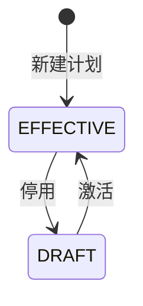
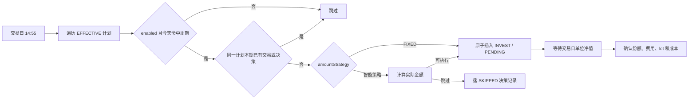

# 自动定投

## 业务目标与边界

定投计划表示用户已经授权系统按固定周期创建买入交易。它是自动执行机制，不是信号，也不经过卖出纪律的 `SignalLog`。

系统只生成内部 `INVEST/PENDING` 交易，不直接调用基金平台扣款或申购。真实平台操作仍由用户自行完成，FundPilot 负责按净值确认并形成份额账本。

## 计划状态



- 新建计划默认 `EFFECTIVE` 且 `enabled=true`。
- 同一基金同时最多一份 `EFFECTIVE` 计划；新建或激活计划时，旧生效计划自动回退 `DRAFT`。
- `DRAFT` 可编辑但不会执行。
- `EFFECTIVE` 可直接修改参数；修改只影响尚未生成的未来交易，历史交易保持不变。
- `enabled=false` 只暂停当前生效计划，不改变其状态；恢复后继续按原周期执行。
- 管理页将底层组合投影为单一用户状态：`EFFECTIVE + enabled=true` 显示“运行中”，`EFFECTIVE + enabled=false` 显示“已暂停”，`DRAFT` 显示“已停用”。
- 只有“已停用”计划允许删除。删除使用软删除，计划不再出现在默认查询中，但已有 `PENDING/CONFIRMED/CANCELLED` 交易及其 `dcaPlanId` 保持不变。

## 频率与参数

| 频率 | 参数 | 执行规则 |
| --- | --- | --- |
| `DAILY` | 无 | 每个交易日执行 |
| `WEEKLY` | `dayOfWeek=1..5` | 只在对应周一至周五执行 |
| `MONTHLY` | `dayOfMonth=1..28` | 计划日执行；遇连续休市顺延到下一个交易日，可跨月 |

每次定投基础金额必须大于 0。周计划不接受周末，月计划不接受 29-31 日。

## 金额策略

计划可配置 `amountStrategy`，决定每次执行的实际买入金额（规则版本固化 `ALIPAY_2025_06_V1`，由纯函数 `SmartInvestmentAmountPolicy` 计算）：

| 策略 | 规则 | 数据不可用时 |
| --- | --- | --- |
| `FIXED` | 按计划金额全额执行 | 不适用（无外部数据依赖） |
| `LOW_VALUATION` | 指数估值百分位 ≤30% 才按 100% 执行；>30% 当日跳过（`VALUATION_NOT_LOW`） | 跳过（`VALUATION_UNAVAILABLE`） |
| `MOVING_AVERAGE` | 按指数收盘价相对 N 日均线的偏离分档定率；下跌且近十日振幅 ≥5% 取加倍档（60%+tier×10%），振幅 <5% 取减半档（160%+tier×10%，即低波动加倍）；上涨按偏离程度取 90%/80%/70%/60% | 跳过（`INDEX_KLINE_UNAVAILABLE`） |
| `CHANGE_RATE` | 按 (最新净值−平均成本)/平均成本 分档：深亏最多 200%，浮亏越多买越多；浮盈 ≥25% 时降至 50%，浮盈越多买越少 | 跳过（`NAV_UNAVAILABLE` / `COST_UNAVAILABLE`） |

- 智能策略的事实数据（估值百分位、指数均线与振幅、基金净值、平均成本）经 `PlanInvestmentFactsGateway` 注入；计算结果金额下限 0.01 元。
- 智能策略当日是否执行的决策（含跳过原因码、档位系数、指标快照）落 `investment_plan_execution` 决策记录；`SKIPPED` 不生成交易。
- FIXED 无决策记录，幂等仅依赖同日交易唯一。

## 自动执行流程



`InvestmentPlanExecutionJob` 先确认当天是 A 股交易日，再逐计划调用独立事务。单个计划失败只记录错误，不影响其他计划。

## 月计划顺延

月计划在判断当日是否补执行时，从本月或上月的计划日期开始检查：

- 如果计划日至昨天之间已经出现交易日，说明本期执行窗口已过去，当天不补。
- 如果计划日至昨天全部为休市日，今天作为顺延后的首个交易日执行。
- 同一计划同一北京时间自然日只允许一条交易，因此任务重跑不会重复生成。
- 新建月计划时若创建时间已过本月计划日的执行窗口（issue #158），首次执行自动顺延到下月，不在创建当月补跑。

## 幂等

幂等键由计划 ID（交易的 `investmentPlanId`）和交易 `tradeDate` 的北京时间自然日共同确定。

同日已有任意状态交易都视为本期已处理：

- `PENDING`：正在等待净值确认。
- `CONFIRMED`：本期已经完成。
- `CANCELLED`：用户明确放弃本期，不能由任务自动重建。

数据库使用原子插入兜底并发重跑，不能只做“先查后写”。

## 月度预算总览

基金列表和定投管理页按北京时间自然月展示全局定投现金流：

- 已定投：本月所有未取消的 `INVEST`，包含手动/自动和 `PENDING`/`CONFIRMED`。
- 本月剩余预计：当前有效且启用计划在本月尚未生成交易的实际执行日金额；同一计划已有任意状态交易的日期不重复计算。
- 全月预计：已定投与本月剩余预计之和。
- 当天只有在 14:55 前仍属于本月剩余预计；月末休市顺延到下月时，金额归属实际执行月份。

定投管理页通过全局计划接口一次取得全部计划、基金信息、本月剩余次数、金额和预计执行日期。预算摘要与逐计划拆分共用 `InvestmentPlanForecastQueryHandler`，逐计划剩余金额之和必须等于摘要的本月剩余预计。

月度预算可空。未设置时仍显示三项金额但不显示进度或超额；设置后显示剩余或预计超出。预算只提示，不暂停计划、不阻止交易生成或净值确认。

## 净值确认时序

```text
14:55 自动生成 INVEST/PENDING
    -> 当晚 20:00-22:59 轮询并落库当日净值
    -> 次日 00:00-09:59 每 10 分钟补拉上一交易日缺失净值
    -> 次日 03:00 按交易自身 tradeDate 确认 PENDING 交易
    -> 扣申购费、计算份额、建立 lot、更新成本和持仓状态
```

如果 03:00 时交易日净值仍缺失，交易保持 PENDING。净值后续补齐后，可由补偿流程或手动确认继续处理，禁止使用下一交易日净值替代。

## 与止盈纪律的关系

- 定投买入与止盈卖出相互独立。
- 新定投 lot 未满 5 个交易日时，只保护该 lot 不进入止盈建议；不会冻结更早的成熟份额。
- 定投交易确认后会增加持仓、建立 lot 并更新成本单价，但不会直接生成卖出信号。

## 失败与错误

| 场景 | 结果 |
| --- | --- |
| 金额非正、频率为空或日期范围非法 | `DCA_PLAN_INVALID` |
| 编辑生效计划 | 更新成功，只影响尚未生成的未来交易 |
| 暂停/恢复非生效计划 | `ILLEGAL_STATE_TRANSITION` |
| 同日已有任意状态交易 | 跳过，不报错 |
| 单只基金生成失败 | 记录错误并继续其他基金 |
| 交易日净值缺失 | 保持 PENDING |
| 删除运行中或已暂停计划 | `DCA_PLAN_DELETE_REQUIRES_DRAFT`，须先停用 |
| 删除已停用计划 | 软删除计划，历史交易保持不变 |

## 实现与验证入口

- 实现：[InvestmentPlanCommandHandler](../../backend/src/main/java/com/fundpilot/backend/investmentplan/application/command/planmanagement/InvestmentPlanCommandHandler.java)、[InvestmentPlanForecastQueryHandler](../../backend/src/main/java/com/fundpilot/backend/investmentplan/application/query/planexecution/InvestmentPlanForecastQueryHandler.java)、[InvestmentPlanBudgetSummaryQueryHandler](../../backend/src/main/java/com/fundpilot/backend/investmentplan/application/query/budgetmanagement/InvestmentPlanBudgetSummaryQueryHandler.java)、[InvestmentPlanExecutionCommandHandler](../../backend/src/main/java/com/fundpilot/backend/investmentplan/application/command/planexecution/InvestmentPlanExecutionCommandHandler.java)
- 测试：[InvestmentPlanCommandHandlerTest](../../backend/src/test/java/com/fundpilot/backend/investmentplan/application/command/planmanagement/InvestmentPlanCommandHandlerTest.java)、[InvestmentPlanForecastQueryHandlerTest](../../backend/src/test/java/com/fundpilot/backend/investmentplan/application/query/planexecution/InvestmentPlanForecastQueryHandlerTest.java)、[InvestmentPlanBudgetSummaryQueryHandlerTest](../../backend/src/test/java/com/fundpilot/backend/investmentplan/application/query/budgetmanagement/InvestmentPlanBudgetSummaryQueryHandlerTest.java)、[InvestmentPlanExecutionCommandHandlerTest](../../backend/src/test/java/com/fundpilot/backend/investmentplan/application/command/planexecution/InvestmentPlanExecutionCommandHandlerTest.java)
- 相关决策：[ADR-0016](../adr/0016-dca-config-auto-invest-not-signal.md)、[ADR-0018](../adr/0018-dca-take-profit-presets-and-cycle.md)、[ADR-0019](../adr/0019-unit-nav-for-accounting.md)、[ADR-0021](../adr/0021-dca-budget-and-position-warnings.md)
