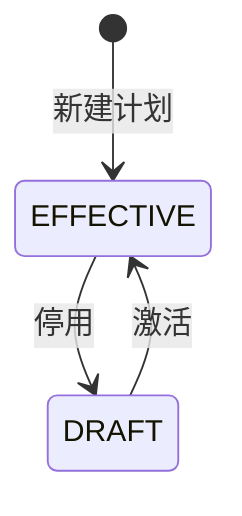
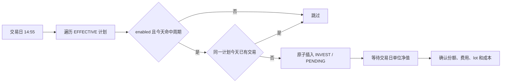

# 自动定投

## 业务目标与边界

定投计划表示用户已经授权系统按固定周期创建买入交易。它是自动执行机制，不是信号，也不经过卖出纪律的 `SignalLog`。

系统只生成内部 `INVEST/PENDING` 交易，不直接调用基金平台扣款或申购。真实平台操作仍由用户自行完成，FundPilot 负责按净值确认并形成份额账本。

## 计划状态



- 新建计划默认 `EFFECTIVE` 且 `enabled=true`。
- 同一基金同时最多一份 `EFFECTIVE` 计划；新建或激活计划时，旧生效计划自动回退 `DRAFT`。
- `DRAFT` 可编辑但不会执行。
- `EFFECTIVE` 不可直接修改参数，需要先停用。
- `enabled=false` 只暂停当前生效计划，不改变其状态；恢复后继续按原周期执行。

## 频率与参数

| 频率 | 参数 | 执行规则 |
| --- | --- | --- |
| `DAILY` | 无 | 每个交易日执行 |
| `WEEKLY` | `dayOfWeek=1..5` | 只在对应周一至周五执行 |
| `MONTHLY` | `dayOfMonth=1..28` | 计划日执行；遇连续休市顺延到下一个交易日，可跨月 |

每次定投金额必须大于 0。周计划不接受周末，月计划不接受 29-31 日。

## 自动执行流程



`DcaSuggestionJob` 先确认当天是 A 股交易日，再逐基金调用独立事务。单只基金生成失败只记录错误，不影响其他计划。

## 月计划顺延

月计划在判断当日是否补执行时，从本月或上月的计划日期开始检查：

- 如果计划日至昨天之间已经出现交易日，说明本期执行窗口已过去，当天不补。
- 如果计划日至昨天全部为休市日，今天作为顺延后的首个交易日执行。
- 同一计划同一北京时间自然日只允许一条交易，因此任务重跑不会重复生成。

## 幂等

幂等键由 `dcaPlanId` 和交易 `tradeDate` 的北京时间自然日共同确定。

同日已有任意状态交易都视为本期已处理：

- `PENDING`：正在等待净值确认。
- `CONFIRMED`：本期已经完成。
- `CANCELLED`：用户明确放弃本期，不能由任务自动重建。

数据库使用原子插入兜底并发重跑，不能只做“先查后写”。

## 月度预算总览

基金列表按北京时间自然月展示全局定投现金流：

- 已定投：本月所有未取消的 `INVEST`，包含手动/自动和 `PENDING`/`CONFIRMED`。
- 未来计划：当前有效且启用计划在本月剩余实际执行日的金额；同一计划已有任意状态交易的日期不重复计算。
- 预计定投：已定投与未来计划之和。
- 当天只有在 14:55 前仍属于未来计划；月末休市顺延到下月时，金额归属实际执行月份。

月度预算可空。未设置时仍显示三项金额但不显示进度或超额；设置后显示剩余或预计超出。预算只提示，不暂停计划、不阻止交易生成或净值确认。

## 净值确认时序

```text
14:55 自动生成 INVEST/PENDING
    -> 当晚 20:00-22:59 轮询并落库当日净值
    -> 次日 03:00 按交易自身 tradeDate 确认 PENDING 交易
    -> 扣申购费、计算份额、建立 lot、更新成本和持仓状态
```

如果 03:00 时交易日净值仍缺失，交易保持 PENDING。净值后续补齐后，可由补偿流程或手动确认继续处理，禁止使用下一交易日净值替代。

## 与止盈纪律的关系

- 定投买入与止盈卖出相互独立。
- 新定投 lot 未满 5 个交易日时，只保护该 lot 不进入止盈建议；不会冻结更早的成熟份额。
- 定投交易确认后会增加持仓、建立 lot 并更新成本单价，但不会直接生成卖出信号。

## 失败与错误

| 场景 | 结果 |
| --- | --- |
| 金额非正、频率为空或日期范围非法 | `DCA_PLAN_INVALID` |
| 编辑生效计划 | `ILLEGAL_STATE_TRANSITION` |
| 暂停/恢复非生效计划 | `ILLEGAL_STATE_TRANSITION` |
| 同日已有任意状态交易 | 跳过，不报错 |
| 单只基金生成失败 | 记录错误并继续其他基金 |
| 交易日净值缺失 | 保持 PENDING |

## 实现与验证入口

- 实现：[DcaPlanService](../../backend/src/main/java/com/fundpilot/backend/dca/service/DcaPlanService.java)、[DcaSuggestionService](../../backend/src/main/java/com/fundpilot/backend/dca/service/DcaSuggestionService.java)、[DcaBudgetSummaryService](../../backend/src/main/java/com/fundpilot/backend/dca/service/DcaBudgetSummaryService.java)、[DcaSuggestionJob](../../backend/src/main/java/com/fundpilot/backend/dca/job/DcaSuggestionJob.java)
- 测试：[DcaPlanServiceTest](../../backend/src/test/java/com/fundpilot/backend/dca/service/DcaPlanServiceTest.java)、[DcaSuggestionJobTest](../../backend/src/test/java/com/fundpilot/backend/dca/job/DcaSuggestionJobTest.java)、[DcaBudgetSummaryServiceTest](../../backend/src/test/java/com/fundpilot/backend/dca/service/DcaBudgetSummaryServiceTest.java)
- 相关决策：[ADR-0016](../adr/0016-dca-config-auto-invest-not-signal.md)、[ADR-0018](../adr/0018-dca-take-profit-presets-and-cycle.md)、[ADR-0019](../adr/0019-unit-nav-for-accounting.md)、[ADR-0021](../adr/0021-dca-budget-and-position-warnings.md)
