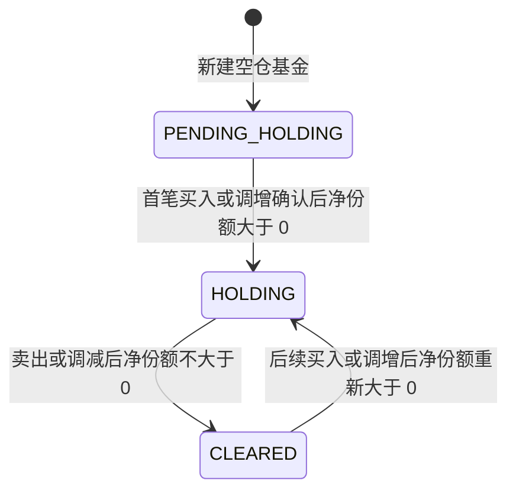
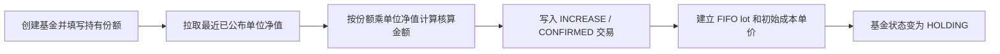

# 基金与持仓

## 业务目标与边界

基金记录用于维护用户关注或持有的基金身份、分类和持仓属性。事实持仓不存冗余金额，由 CONFIRMED 交易份额实时聚合。

本流程不负责决定买哪只基金，也不通过信号自动建仓。用户可以创建空仓观察基金、录入已有持仓，或后续通过手动交易和自动定投增加份额。

## 核心对象

### 基金分类

| 字段 | 用途 |
| --- | --- |
| `FundCategory` | 宽基、行业、主动、混合；用于推荐定投止盈参数 |
| `FundSubType` | ETF、指数、指数增强、主动；用于选择行情和逻辑止损路径 |
| `benchmarkIndexCode` | 指数类基金的跟踪指数；主动基金可以为空 |

新建基金时优先使用基金字典搜索结果；`FundCategory` 和 `FundSubType` 同时缺失时，后端按名称启发式识别。识别结果允许用户后续覆盖。

### 基金状态

状态目标由 CONFIRMED 交易决定：

| 条件 | `FundStatus` |
| --- | --- |
| 没有 CONFIRMED 交易 | `PENDING_HOLDING` |
| CONFIRMED 净份额大于 0 | `HOLDING` |
| 已有 CONFIRMED 交易且净份额不大于 0 | `CLEARED` |

普通 PENDING 交易不进入持仓，也不提前改变状态。交易确认、撤销或调整落账后统一调用 `reconcileStatus`。

## 新建空仓基金

1. 用户通过基金字典按代码或名称搜索候选。
2. 选中候选后回填代码、名称、分类、子类型和跟踪指数。
3. 后端校验基金身份、`FundCategory` 和仓位提醒线；仓位提醒只影响展示。
4. 保存基金，初始状态为 `PENDING_HOLDING`。
5. 发布 `FundCreatedEvent`，事务提交后由后台异步补充净值历史和行情指标。

空仓基金也会进入净值历史拉取和盘中估值缓存，因此可作为观察池查看今日涨跌。

## 初始持仓录入

新建时填写 `initialHoldingShares` 表示用户已经持有该基金，系统按历史仓位盘点处理：

关键规则：

- `initialHoldingShares` 必须大于 0，直接作为事实持仓份额。
- 使用最近一期已公布的单位净值计算初始交易核算金额，不使用 `openedAt` 对应历史净值。
- `costPerShare` 可选；未填写时使用同一单位净值，填写时必须大于 0。
- `openedAt` 可选；未填写时使用当前时间，不能晚于当前时间。
- 初始持仓同步确认，不等待夜间 `NavConfirmJob`。
- 初始持仓建立 FIFO lot，但不重复计算申购费。
- 缺少有效净值时，创建事务整体失败；仓位提醒不会阻断建仓。

## 持仓属性

- 持仓份额：CONFIRMED 交易按来源方向求和。
- 在途份额：PENDING 交易按来源方向求和，仅用于展示或检查，不进入事实持仓。
- `openedAt`：首次进入或重新进入 `HOLDING` 时，从已确认正向交易的业务时间确定。
- `costPerShare`：买入确认时按实际投入金额加权；卖出不修改。
- 历史高点和持有期高点：从累计净值历史实时派生，不在基金表冗余存储。

## 归档

归档是记录可见性操作，与 `FundStatus` 正交。任意持仓状态都可以归档；基金及关联交易、信号、策略和行情记录通过软删除从默认查询中隐藏，物理数据仍保留。

## 失败与错误

| 场景 | 结果 |
| --- | --- |
| 代码和名称都为空 | `MISSING_FUND_IDENTITY` |
| 基金类型为空 | `FUND_CATEGORY_REQUIRED` |
| 持有份额非正 | `INITIAL_HOLDING_SHARES_INVALID` |
| 成本单价非正 | `COST_PER_SHARE_INVALID` |
| 建仓时间在未来 | `OPENED_AT_IN_FUTURE` |
| 无有效单位净值 | `NAV_HISTORY_EMPTY` |

## 实现与验证入口

- 实现：[FundService](../../backend/src/main/java/com/fundpilot/backend/fund/service/FundService.java)、[FundPositionService](../../backend/src/main/java/com/fundpilot/backend/fund/service/FundPositionService.java)、[FundArchiveService](../../backend/src/main/java/com/fundpilot/backend/fund/service/FundArchiveService.java)
- 测试：[FundServiceTest](../../backend/src/test/java/com/fundpilot/backend/fund/service/FundServiceTest.java)、[FundServiceAutoFetchTest](../../backend/src/test/java/com/fundpilot/backend/fund/service/FundServiceAutoFetchTest.java)、[FundPositionServiceTest](../../backend/src/test/java/com/fundpilot/backend/fund/service/FundPositionServiceTest.java)
- 相关决策：[ADR-0001](../adr/0001-derive-peak-navs-instead-of-storing.md)、[ADR-0012](../adr/0012-existing-position-onboarding.md)、[ADR-0013](../adr/0013-cost-per-share-stored-instead-of-derived.md)、[ADR-0021](../adr/0021-dca-budget-and-position-warnings.md)
