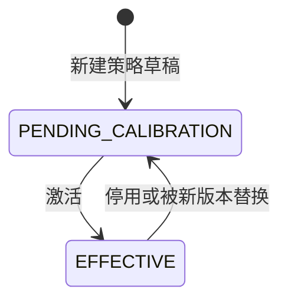
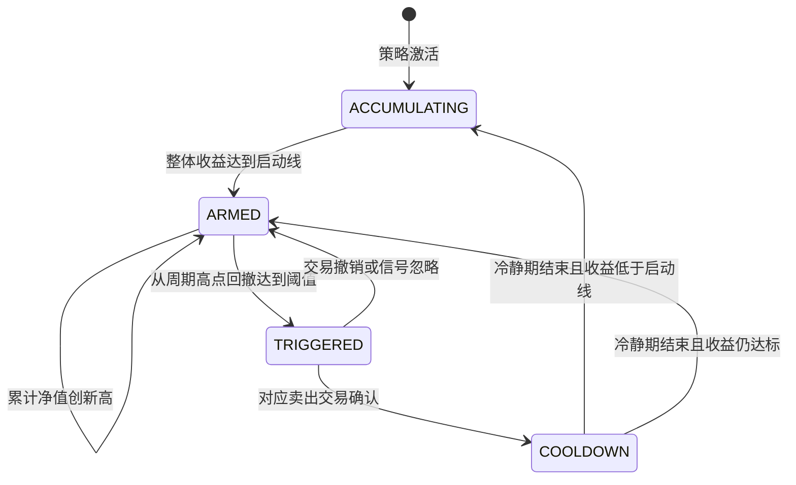
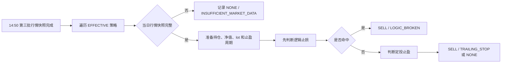

# 卖出纪律与信号

## 业务目标与边界

卖出纪律根据已确认持仓、当前生效策略和行情快照生成建议。系统不会自动创建真实赎回订单；用户确认建议后才建立 `DECREASE/PENDING` 交易，交易确认后才改变事实持仓。

当前信号引擎只生成 `NONE/SELL`。`BUILD/ADD` 仅用于历史日志和历史回应兼容。

## 策略配置版本

`PENDING_CALIBRATION` 的枚举名源于历史校准流程，当前含义就是草稿。`CALIBRATED/CALIBRATION_FAILED` 仍可读取存量数据，但当前流程不会进入。

同一基金最多一份 `EFFECTIVE` 策略。激活新版本会停用旧版本、结束旧激活任期并清理运行时止盈周期。

## 定投止盈周期

定投止盈使用两个净值口径：

- 单位净值：计算持仓成本、当前市值、浮盈和建议卖出份额。
- 累计净值：记录周期高点并计算高点回撤。

关键规则：

- 从 `ACCUMULATING` 进入 `ARMED` 的当天只建立周期基准，不立即卖出。
- `TRIGGERED` 期间保留原始可操作信号，日常重跑不能用新的 NONE 日志覆盖。
- 交易撤销或信号忽略后恢复 `ARMED`，同时清除旧高点；下一次评估重新建立基准，避免同一回撤立即重复触发。
- 交易确认后进入 `COOLDOWN`，冷静期按交易日计算。

### 建议卖出份额

建议份额取以下四项最小值：

1. `浮盈 * profitHarvestPercent / 当前单位净值`
2. `当前份额 * maxSingleSellPercent`
3. 已持有至少 5 个交易日的成熟 lot 份额，加合法未跟踪调整份额
4. `当前份额 * (1 - minimumHoldingPercent)`

因此新定投 lot 只保护自身，不会锁住全部历史持仓。

### 类型推荐参数

推荐只依据 `FundCategory`，不依据 `FundSubType`：

| 类型 | 启动收益 | 高点回撤 | 浮盈收割 | 最低保留 |
| --- | --- | --- | --- | --- |
| 宽基 | 15% | 6% | 50% | 50% |
| 行业 | 20% | 8% | 50% | 40% |
| 主动 | 15% | 7% | 50% | 50% |
| 混合 | 12% | 5% | 40% | 60% |

默认单次卖出上限 20%，冷静期 10 个交易日。所有比例按正数存储，用户保存自定义值后不会被模板静默覆盖。

## 逻辑破坏止损

逻辑破坏止损优先级高于定投止盈，目标是建议清空全部 CONFIRMED 事实持仓。

| 基金子类型 | 必须同时满足的条件 |
| --- | --- |
| ETF、指数、指数增强 | 累计净值跌破年线；周 MACD 绿柱扩大；跟踪指数放量下跌 |
| 主动/混合路径 | 累计净值跌破年线；周 MACD 绿柱扩大 |

逻辑止损可以突破最近买入 5 个交易日的保护窗口，并记录 `MIN_HOLD_DAYS_OVERRIDDEN` 警告。最低保留仓位不适用于逻辑止损。

命中止损只生成 SELL 建议，不会立即把基金状态改成 `CLEARED`。用户确认后创建全仓 `DECREASE/PENDING`，最终在交易确认并重算净份额后进入 `CLEARED`。

## 信号生成

- 行情第三批和信号生成使用同一调度入口，第三批失败时不继续生成信号。
- 每只基金每个北京时间业务日最多一行信号日志。
- 单只基金失败使用独立事务，不影响其他基金。
- 已回应或已忽略信号不会被管理员重跑覆盖。
- 新的逻辑止损可以将尚未回应的止盈信号标记为忽略，并取代其优先级。

## 信号状态与回应

信号操作状态是动态投影，不额外持久化：

| 状态 | 含义 |
| --- | --- |
| `INFORMATIONAL` | `NONE`，无需回应 |
| `PENDING` | 仍可确认或忽略 |
| `RESPONDED` | 已生成关联交易 |
| `IGNORED` | 用户已忽略 |
| `EXPIRED` | 普通信号已过最近交易日有效期 |

普通信号只在当前日期之前最近一个交易日内可操作。当前策略绑定的 `TRIGGERED` 止盈信号可跨日等待处理。

确认信号时：

- 路径基金必须与信号所属基金一致。
- 同一信号最多生成一笔未软删交易。
- `TRAILING_STOP` 使用用户确认的正数份额。
- `LOGIC_BROKEN` 在基金行锁内重新读取全部 CONFIRMED 持仓，并创建全仓卖出交易。
- 交易状态初始为 PENDING，保留 `signalLog` 关联。

## 失败与错误

| 场景 | 结果 |
| --- | --- |
| 无生效策略或基金没有正持仓 | 生成 NONE 或跳过止盈评估 |
| 当日行情快照缺失 | `INSUFFICIENT_MARKET_DATA` |
| 路径基金与信号不一致 | `SIGNAL_FUND_MISMATCH` |
| 信号已回应、忽略或过期 | `SIGNAL_ALREADY_RESPONDED` / `SIGNAL_ALREADY_IGNORED` / `SIGNAL_EXPIRED` |
| SELL 份额为空或非正 | `MISSING_ACTUAL_SHARES` / `SIGNAL_OPERATION_VALUE_INVALID` |
| 逻辑止损确认时已无持仓 | `INSUFFICIENT_HOLDING_SHARES` |

## 实现与验证入口

- 实现：[StrategyConfigService](../../backend/src/main/java/com/fundpilot/backend/strategy/service/StrategyConfigService.java)、[TakeProfitLifecycleService](../../backend/src/main/java/com/fundpilot/backend/strategy/service/TakeProfitLifecycleService.java)、[DisciplineStrategyService](../../backend/src/main/java/com/fundpilot/backend/strategy/service/DisciplineStrategyService.java)、[SignalGenerationService](../../backend/src/main/java/com/fundpilot/backend/signal/service/SignalGenerationService.java)、[SignalOperationService](../../backend/src/main/java/com/fundpilot/backend/signal/service/SignalOperationService.java)、[SignalActionabilityService](../../backend/src/main/java/com/fundpilot/backend/signal/service/SignalActionabilityService.java)
- 测试：[TakeProfitLifecycleServiceTest](../../backend/src/test/java/com/fundpilot/backend/strategy/service/TakeProfitLifecycleServiceTest.java)、[DisciplineStrategyServiceTest](../../backend/src/test/java/com/fundpilot/backend/strategy/service/DisciplineStrategyServiceTest.java)、[SignalGenerationServiceTest](../../backend/src/test/java/com/fundpilot/backend/signal/service/SignalGenerationServiceTest.java)、[SignalOperationServiceTest](../../backend/src/test/java/com/fundpilot/backend/signal/service/SignalOperationServiceTest.java)、[SignalActionabilityServiceTest](../../backend/src/test/java/com/fundpilot/backend/signal/service/SignalActionabilityServiceTest.java)
- 相关决策：[ADR-0015](../adr/0015-pyramid-retire-trailing-stop-decouple.md)、[ADR-0016](../adr/0016-dca-config-auto-invest-not-signal.md)、[ADR-0018](../adr/0018-dca-take-profit-presets-and-cycle.md)、[ADR-0019](../adr/0019-unit-nav-for-accounting.md)
