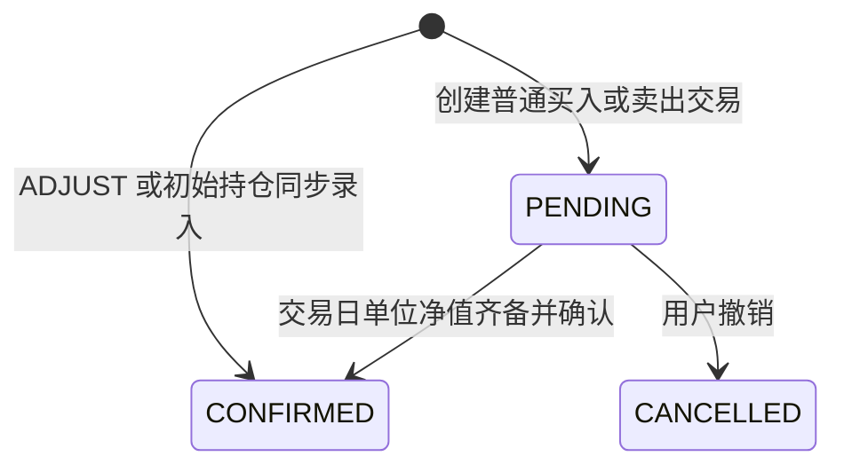
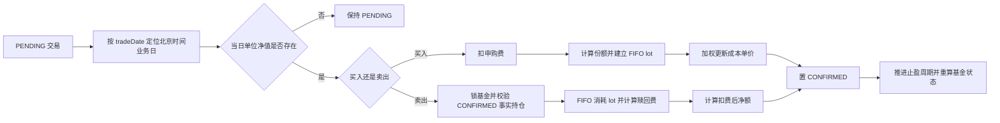

# 交易与记账

## 业务目标与边界

交易账本记录用户真实发生或准备发生的份额变化。系统不直接下单，而是在用户录入、定投执行或信号回应后建立交易记录，并在交易发生日单位净值可用时完成确认。

## 交易来源

| 来源 | 方向 | 创建时已知 | 确认时补充 | 说明 |
| --- | --- | --- | --- | --- |
| `INCREASE` | 增加 | 金额 | 份额、净值、费用 | 手动加仓或遗留买入信号 |
| `TRANSFER_IN` | 增加 | 金额；转换联动时可暂空 | 份额、净值、费用 | 转入或基金转换转入腿 |
| `INVEST` | 增加 | 金额 | 份额、净值、费用 | 手动定投或自动定投 |
| `DECREASE` | 减少 | 份额 | 净额、净值、费用 | 手动减仓或卖出信号 |
| `TRANSFER_OUT` | 减少 | 份额 | 净额、净值、费用 | 转出或基金转换转出腿 |
| `ADJUST_IN` | 增加 | 份额 | 无 | 账实调增，录入即确认 |
| `ADJUST_OUT` | 减少 | 份额 | 无 | 账实调减，录入即确认 |

信号触发的交易保留 `signalLog` 关联；手动交易和自动定投的 `signalLog` 为空。自动定投通过 `dcaPlanId` 关联执行计划。

## 交易状态

- `CONFIRMED` 和 `CANCELLED` 都是终态，不能再次确认或撤销。
- PENDING 不进入事实持仓。
- 所有来源的 PENDING 主流水都可在基金详情或操作确认工作台修改；买入类可改金额和交易日期，卖出类可改份额和交易日期。
- 修改信号或定投流水只影响本次执行，不修改来源计划；来源、基金、关联关系和转换目标不可修改。
- 确认或调整落账后，根据全部 CONFIRMED 交易重算基金状态。

## 手动交易

用户在基金详情的交易流水页录入交易：

- 买入类必须填写正数金额。
- 卖出类必须填写正数份额。
- `ADJUST_IN/OUT` 必须填写正数份额，录入即确认，不计算净值、金额或手续费。
- `tradeDate` 可选，默认当前时间；未来时间被拒绝。
- 手动卖出不经过卖出信号和 5 个交易日建议信号保护，但确认时仍按真实持仓、FIFO lot 和费率校验。

## 操作确认工作台

`/confirm` 跨基金汇总全部 `PENDING` 交易，按交易发生时间倒序展示，并提供编辑、手动确认和撤单。菜单红点与行情工作台待办数量使用同一全局待处理交易口径。

## 基金转换

当用户以 `TRANSFER_OUT` 并指定目标基金时，系统创建两条互相关联的 PENDING 交易：

1. 转出腿：源基金、`TRANSFER_OUT`、已知份额。
2. 转入腿：目标基金、`TRANSFER_IN`、金额和份额暂空。
3. 两条腿使用同一 `tradeDate`。
4. 两只基金同日单位净值都齐备后，先确认转出腿并得到扣费后净额，再将该净额作为转入腿金额计算目标份额。

正常情况下两条腿在同一事务中确认或撤销。历史半状态只允许在转出腿已经确认时补确认转入腿。
转入腿由转出结果派生，不可单独编辑；修改转出腿交易日期时，两条腿的日期同步更新。

## 份额精度与全量卖出

- 份额最小单位统一为 `0.01` 份，写入时按 `HALF_UP` 保留两位；交易、lot、赎回明细和持仓不保留隐藏尾差。
- “全部卖出/转出”冻结点击时的两位事实持仓。确认时仍重新锁定并校验 CONFIRMED 持仓，期间减少持仓会正常拒绝超卖。
- V23 会把存量份额舍入到两位并重建 lot 与赎回明细。生产部署前必须备份数据库；迁移或重建失败时应用不得启动。

## 净值确认

自动批量确认与手动确认共用相同的费用、lot、成本和持仓规则：

- 自动确认由 `NavConfirmJob` 在凌晨 03:00 扫描历史 PENDING 交易，并按基金使用独立事务。
- 新净值提交后会发布更新事件，立即补偿对应基金；应用启动和每小时任务也会扫描具备净值条件的历史 PENDING 交易。
- 手动确认用于净值已经落库但交易仍未确认的场景。
- 两种路径都必须读取交易自身 `tradeDate` 对应的单位净值，禁止用最新或未来净值替代。
- 当日净值缺失时，自动确认保持 PENDING；手动确认返回 `NAV_HISTORY_EMPTY`。

## 费用与 FIFO lot

### 买入

- 实际份额 = `(交易金额 - 申购费) / 单位净值`，结果按 `HALF_UP` 保留两位。
- 每笔 `INCREASE/TRANSFER_IN/INVEST` 确认后建立一个 lot。
- lot 记录取得时间、取得份额、剩余份额和取得成本单价。
- 成本单价的加权分子使用用户完整投入金额，申购费属于实际成本。

### 卖出

- 确认前锁定基金行，并重新汇总 CONFIRMED 事实持仓，防止并发超卖。
- 按 lot 取得时间从早到晚消耗份额。
- 每段份额按实际持有天数匹配赎回费率。
- 卖出净额 = `份额 * 单位净值 - 赎回费`。
- 合法的 `ADJUST_IN` 未跟踪份额可以在普通 lot 耗尽后按零赎回费处理；其他 lot 缺口视为账本异常。

费率数据缺失时降级为零费用并记录日志，不阻断交易确认。

## 持仓与成本

- CONFIRMED 净份额 = 增加方向份额之和 - 减少方向份额之和。
- `ADJUST_OUT` 会优先缩减现有 open lot，但不生成赎回明细和费用。
- 买入确认在 Accounting `Position.costPerShare` 上加权更新；卖出不改变成本单价。
- 清仓后再次买入时，如果旧份额不大于 0，新买入成本自然成为新的成本基准。

## 失败与错误

| 场景 | 结果 |
| --- | --- |
| 买入缺少正数金额、卖出缺少正数份额 | `MANUAL_TRANSACTION_FIELD_REQUIRED` |
| 调减或卖出超过事实持仓 | `INSUFFICIENT_HOLDING_SHARES` |
| 确认时交易日单位净值缺失 | 自动保持 PENDING；手动返回 `NAV_HISTORY_EMPTY` |
| 已确认交易再次确认或撤销 | `TRANSACTION_ALREADY_CONFIRMED` |
| 已撤销交易再次确认或撤销 | `TRANSACTION_ALREADY_CANCELLED` |
| 转换两腿进入非法半状态 | `ILLEGAL_STATE_TRANSITION` |
| lot 缺口不是合法调整份额 | `INSUFFICIENT_LOTS` |

## 实现与验证入口

- 实现：[FundTransactionService](../../backend/src/main/java/com/fundpilot/backend/fund/service/FundTransactionService.java)、[TransactionConfirmService](../../backend/src/main/java/com/fundpilot/backend/fund/service/TransactionConfirmService.java)、[TransactionCancelService](../../backend/src/main/java/com/fundpilot/backend/fund/service/TransactionCancelService.java)、[NavConfirmService](../../backend/src/main/java/com/fundpilot/backend/fund/service/NavConfirmService.java)、[TransactionConfirmSupport](../../backend/src/main/java/com/fundpilot/backend/fund/service/TransactionConfirmSupport.java)
- 测试：[FundTransactionServiceTest](../../backend/src/test/java/com/fundpilot/backend/fund/service/FundTransactionServiceTest.java)、[TransactionConfirmServiceTest](../../backend/src/test/java/com/fundpilot/backend/fund/service/TransactionConfirmServiceTest.java)、[NavConfirmAndCancelServiceTest](../../backend/src/test/java/com/fundpilot/backend/fund/service/NavConfirmAndCancelServiceTest.java)、[TransactionConfirmSupportTest](../../backend/src/test/java/com/fundpilot/backend/fund/service/TransactionConfirmSupportTest.java)
- 相关决策：[ADR-0013](../adr/0013-cost-per-share-stored-instead-of-derived.md)、[ADR-0019](../adr/0019-unit-nav-for-accounting.md)、[ADR-0021](../adr/0021-dca-budget-and-position-warnings.md)
